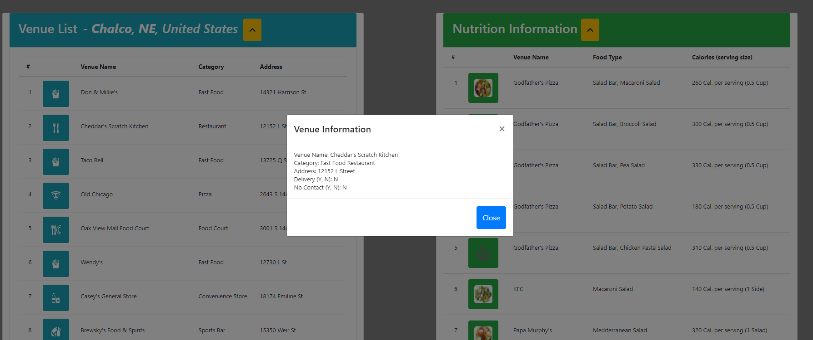
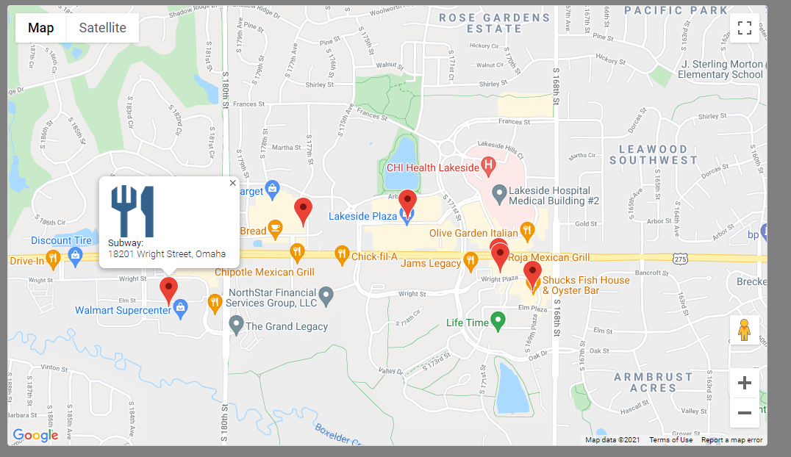

[](https://opensource.org/licenses/MIT)

# Project 1: Delivery Done Right

## Project Goal

The user will be able to search and filter restaurants by certain features. Features will include the restaurants near the user, delivery/no delivery/no contact delivery for those restaurants shown via Modals, & nutrition information for products related to the keyword search.

Future feature: extend the program to include grocery delivery information along with FDA approved nutrition labels for all products searched.

The application will be using the following APIs:

- https://api.openweathermap.org
- https://api.foursquare.com
- https://trackapi.nutritionix.com/v2/locations
- https://maps.googleapis.com/maps/api/places

## User Story

```
AS A local eater
I WANT to find nearby restaurants by a keyword search that have delivery services along with nutrition information
SO THAT I can choose a restaurant based on my preferences
```

## Acceptance Criteria

```
WHEN I open the web application
THEN I am provided a search input form
WHEN I start my input search
THEN I can enter text corresponding to the food that I want by zip code and meter radius parameters
WHEN I enter the input parameters and click the search button
THEN I am presented with information of restaurants with my search criteria
WHEN I click on a location listed
THEN I can view if they have delivery, a different form of delivery (such as no-contact), or no delivery
WHEN I search the key word of food items
THEN I am presented with nutritional information of that keyword
WHEN I search a different keyword
THEN I store the previous information into LocalStorage to access again
```

## Table of Contents

- [Links to Application](#Links)
- [Features](#Features)
- [Development](#Development)
- [Credits](#credits)
- [Collaborators](#Collaborators)

## Links

Below are links to access this live website and repository.

Github: https://github.com/japinell/KU-CBC-Project-1-Delivery-Done-Right

Deployed URL: https://japinell.github.io/KU-CBC-Project-1-Delivery-Done-Right/

## Features

---

The following image shows the web application's appearance and functionality:

Basic layout consists of our search form and a google map side by side. Below that, we have our Venue List and Nutrition Information listed in table format. This is done VIA keyword search.


---

When a user clicks on the button associated with the Venue of their choice, a modal will present itself with information pertaining to that location.

The modal will indicate whether the restaurant delivery/no delivery/no-contact delivery as well as the restaurants basic information.



---

Our map, generated by google places API, will pinpoint and place map markers within the inputted zip code and meter radius. This will pin all restaurants in the area, even if it is outside of their operation hours.

When the user clicks on the map pin, a window will present itself with the restaurants name, address, and icon.



---

Each table implements an accordion button function that will allow the user to minimize the list down to hide the results. This button is displayed in a yellow color.


## Development

---

The team's initial wireframe is shown below to plan the project and design moving forward.


## Credits

The following lists the API's that are used to develop our web application:

- https://api.openweathermap.org
- https://api.foursquare.com
- https://trackapi.nutritionix.com/v2/locations
- https://maps.googleapis.com/maps/api/places
  <br>
  Bootstrap for CSS styling: (https://getbootstrap.com/).

## Collaborators

Group 5: `Delivery Boys`

- `Travis Brown` @ https://github.com/bergannation
- `Joel Stockard` @ https://github.com/jtstockard
- `Rigo A Pinell` @ https://github.com/japinell
